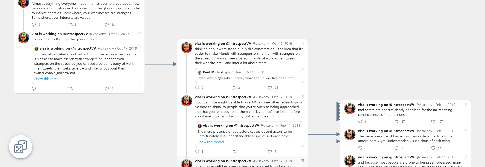

# Visa Viz
Twitter thread explorer made in C++/Wasm/WebGL

Once upon a time, I stumbled upon [@visakanv](https://twitter.com/visakanv)'s network of threads, but it was too cumbersome to explore through the official clients. This web app allows to browse the whole network, it walks and quacks like a web app but is built with as little HTML/JS/CSS as possible (currently around 3%), using C++/Wasm/WebGL instead. It serves 2000 threads, 18000 tweets and about as much text as "War and Peace" novel.

You can try it out at [https://visa-viz.github.io](https://visa-viz.github.io).

Controls: pan with RMB, zoom with Ctrl +/-, button in the corner teleports you to a random thread.

## Building and running locally
This repo has a mock set of threads that illustrates every type of tweet that is supported without having you to download gigabytes of real data.
* Install and activate [Emscripten 2.0.31+](https://emscripten.org/docs/getting_started/downloads.html)
* Update paths in `scripts/build.ps1`
* Install [PowerShell](https://docs.microsoft.com/en-us/powershell/scripting/install/installing-powershell) - it runs on macOS and Linux too. Version 5.1 bundled with Windows 10 is good enough.
* Run `./build_mock.ps1`
* Run `./host.ps1`
* Play with it at `http://localhost:8000`

## Running tests
* Install [WASI SDK 12+](https://github.com/WebAssembly/wasi-sdk/releases)
* Install [Wasmtime 0.30+](https://wasmtime.dev/)
* On Windows, install [VS C++ 2015 Redistributable](https://www.microsoft.com/en-us/download/details.aspx?id=53840) if you don't have it
* Update paths in `test.ps1`
* Run `./test.ps1`

## Setting up VS Code
* Update `.vscode/c_cpp_properties.json` to point it to your C++ compiler
* If using PowerShell bundled with Windows, replace `pwsh` with `powershell` in `.vscode/tasks.json`

## Features that could've been but aren't
* Text tracking/kerning
* Smooth zoom
* Clickable links
* Context menus
* Full text search
* Displaying everything at once